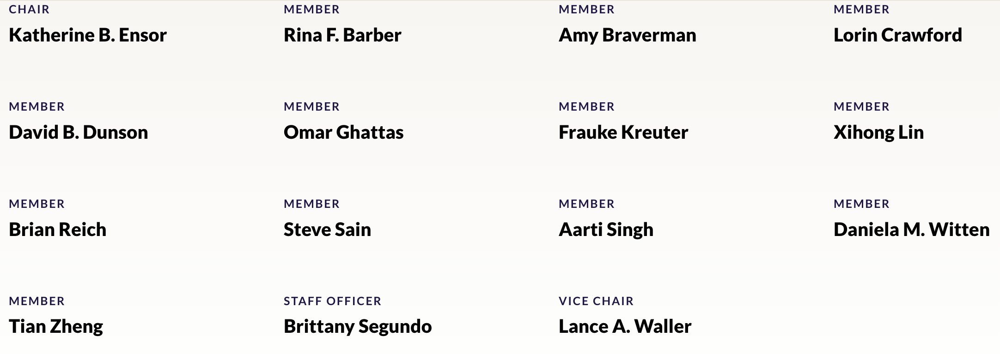

I am honored to serve on the [National Academies Committee on the Frontiers of Statistics in Science and Engineering: 2035 and Beyond](https://www.nationalacademies.org/our-work/frontiers-of-statistics-in-science-and-engineering-2035-and-beyond)

The committee will produce a forward-looking assessment of the state of the statistical sciences, emerging opportunities, and the evolving needs of allied fields. Our work spans:

+ Statistical research and emerging trends, challenges, and directions
+ Interactions with allied fields such as AI, data science, engineering, and the sciences
+ Urgent statistical needs for responsible use of new technologies (from LLMs to digital twins to hybrid models)
+ Interdisciplinary collaborations critical for American competitiveness
+ Education, training, and workforce development to prepare the next generation of statisticians and data scientists

This effort reflects a belief I hold deeply: statistics is foundational for discovery and innovation, and its future depends on how we connect across disciplines and integrate education with research. I’m excited to contribute to this important work and to conversations about where our field is headed in the decades to come.

