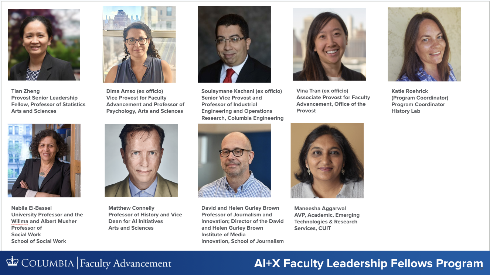

Grounded in the belief that faculty are the drivers of transformative educational change, this emerging initiative seeks to accelerate progress in AI education at scale by empowering faculty to lead innovative, cross-disciplinary efforts.

<!--more-->


## Overview
In June 2025, I joined the Data Science Institute’s university-wide AI education retreat, which brought together thought leaders across disciplines to envision the future of AI-integrated learning. The conversations surfaced many important insights and ultimately inspired the vision for the AI+X Faculty Leadership Fellows Program — a program designed to support faculty advancement as institutions adapt to rapid technological change.

### Program Objectives

+ Foster cutting-edge curriculum innovation integrating AI with disciplinary expertise ("AI+X").
+ Build a supportive, cross-disciplinary cohort of faculty advancing AI Education (e.g. teaching with AI, teaching of AI, and teaching for responsible development and
deployment of AI that is contextualized in individual disciplines).
+ Leverage university-wide educational and technical resources efficiently.
+ Focus on Columbia units without existing resources for promoting AI in Education
+ Develop and disseminate reusable course components, templates, and best practices.

## Year Beta

During the 2025-2026 academic year, as a Provost Senior Leadership Fellow in the Office of Vice Provost of Faculty Advancement, I am launching a **Year Beta** towards this vision. 

### Yeat Beta Mission

Develop a program with strong potential for success and effectiveness in meeting the aims broadly and at scale. We will identify needs and opportunities, understand risks and constraints that need to be addressed, and design solutions and action plans. We will roll out activites and event to engage stakeholders and build necessary partnerships and infrastructure.

I feel extremely fortunate to be working with a group of devoted leaders on this important work. 

